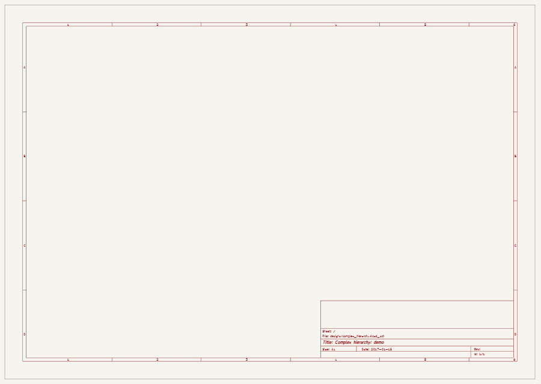
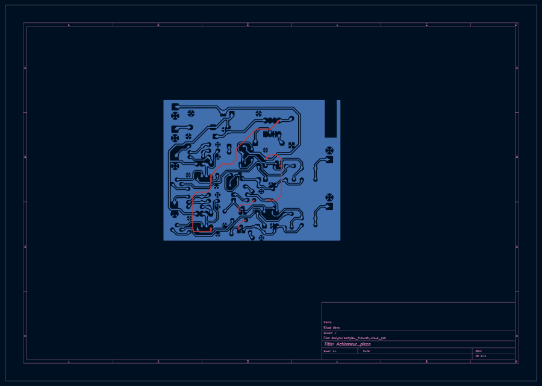

# KiCad HTML viewer

Viewer for viewing KiCad designs in a HTML page.

Support: KiCad 9 and higher

[](https://github.com/dannyvanderpol/kicad_html_viewer/actions/workflows/publish_js.yml)
[](https://github.com/dannyvanderpol/kicad_html_viewer/actions/workflows/deploy_pages.yml)

## Features

* Drawing designs in a canvas.
  * Schematics:
    * Drawing sheet border.
  * PCB:
    * Drawing sheet border.
    * Drawing zones on copper layers.
  * Pan and zoom.

* Roadmap:
  * V1.0: Can draw a complete schematics and PCB.

## Screenshots

Note that the screenshots are not of a high resolution and only here to give you an impression.

### Schematics



### PCB



## Usage

Create a HTML page and include the minified buid.

``` html
<html>
<head>
    <title>Test page</title>
    <meta charset="utf-8">
    <meta name="viewport" content="width=device-width, initial-scale=1">
    <!-- include the JS module:
      - use the -dev for development versions (may not be stable)
      - use the .x.y for a stable version (tested, with test designs)
    -->
    <script type="module" src="ki_viewer-dev.min.js"></script>
</head>
<body>
    <!-- Add canvas for a design, the module does its magic -->
    <canvas src="path/to/your.kicad_sch" type="application/kicad" width="900" height="640"></canvas>
    <canvas src="path/to/your.kicad_pcb" type="application/kicad" width="900" height="640"></canvas>
</body>
</html>
```

You can add as many canvas elements as you wish.
The JS module starts working on the `DOMContentLoaded` event.

### Disclamer

This software can be used for any purpose, in case of any issues, open an issue in the issue tracker.
For the rest, you are on your own. I do not accept any liabilities when using this software.
